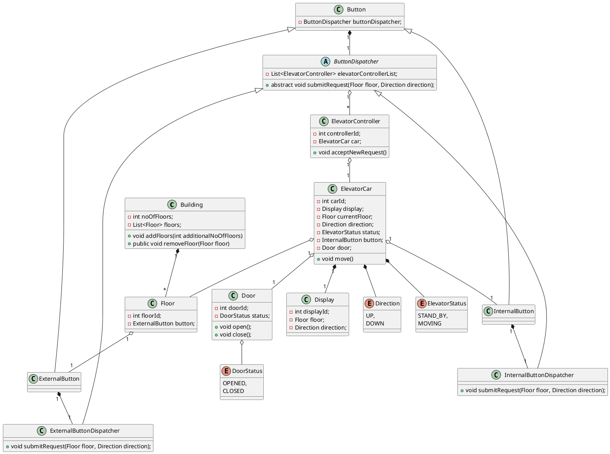

# Elevator System

## Requirements:
- How many number of lifts? > n
- How the lift will dispatch?

## Objects
- Building
- Floor
- ExternalButton
- ElevatorCar
- Display
- InternalButton
- Door

## Enums
- Direction
- ElevatorStatus
- DoorStatus

