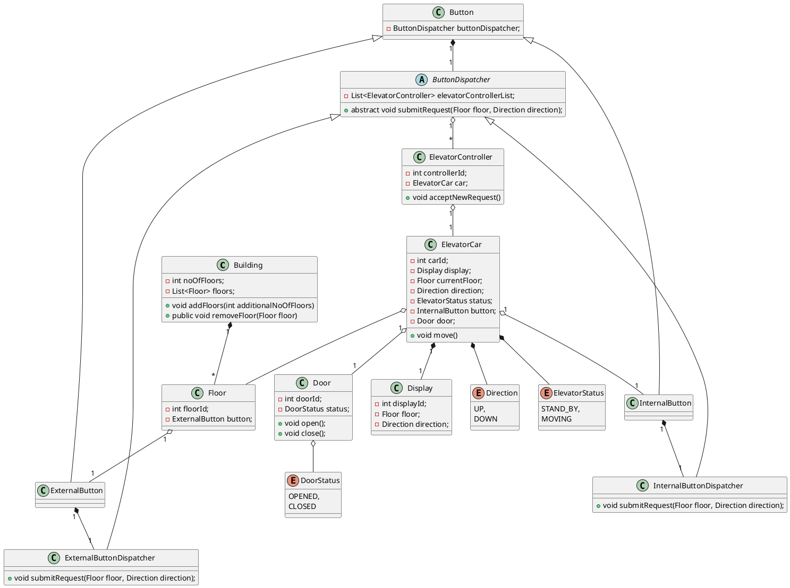
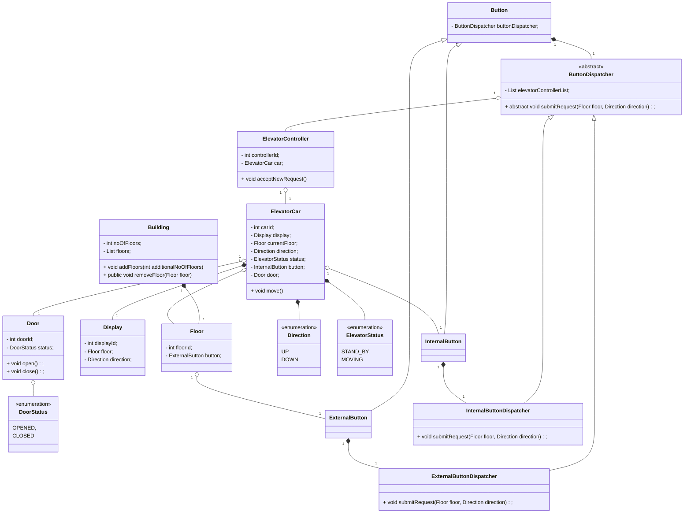

# Elevator System
This document outlines the structure and components of an elevator system using UML and Mermaid diagrams to visualize 
the relationships between different objects, enums, and components in the system.

## Requirements:
- **Number of Lifts:** Define the number of lifts (n) in the building.
- **Lift Dispatch Logic:** Implement logic to dispatch the lift based on requests.

## Objects

### Main Components
- Building: Represents the building that houses the elevator system.
- Floor: Represents a single floor in the building.
- ElevatorCar: Represents an individual elevator car, which includes properties like the current floor, status, and direction.
- Display: Shows the elevator's current status and direction.
- Door: Represents the door of an elevator, which can open and close based on the elevator's movement.

### Buttons
- ExternalButton: Placed on each floor to call the elevator.
- InternalButton: Placed inside the elevator for selecting floors.

### Enums
Enums represent fixed sets of values related to elevator states and directions.
- Direction: Represents the movement direction of the elevator (either UP or DOWN).
- ElevatorStatus: Indicates the elevator's current status (e.g., STAND_BY, MOVING).
- DoorStatus: Represents the status of the door (either OPENED or CLOSED).

## UML Class Diagram (PlantUML)
This UML diagram, rendered using PlantUML, represents the core components, their properties, and their relationships 
within the system.

## Class Diagram (Mermaid)
The following class diagram represents the system's classes and their relationships, rendered using Mermaid.

